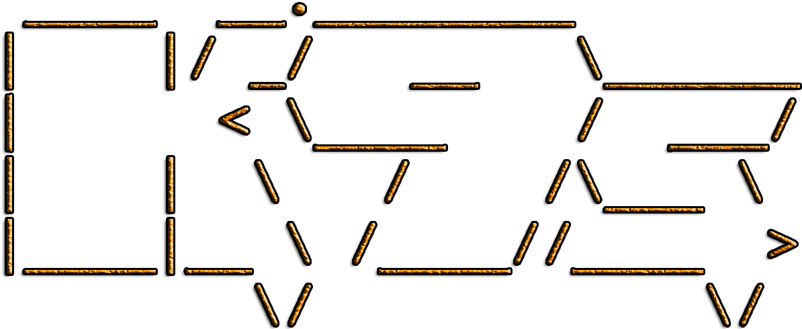
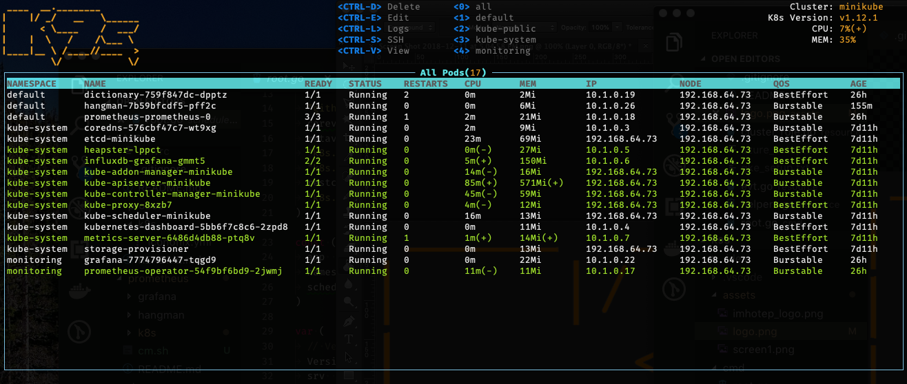
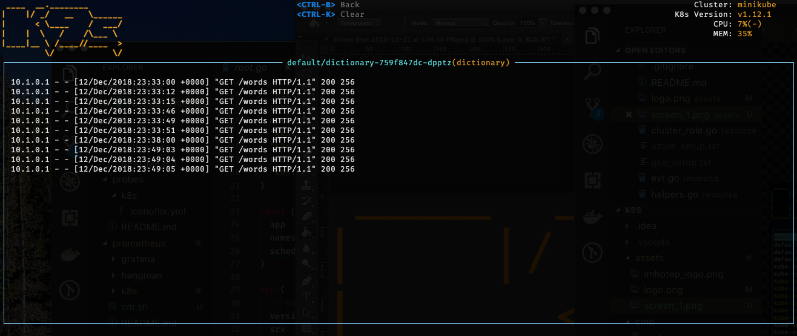

# K8scmd - Kubernetes graphical CLI

A Kubernetes CLI written in GO and curses to interact with your clusters. The initial
aim of this project is to make it simpler to navigate and diagnose a cluster.

<br/>

---

[](https://goreportcard.com/report/github.com/k8sland/k9s)
[](https://travis-ci.org/k8sland/k9s)


<br/>

---
## Description

K8scmd is a CLI for Kubernetes. It provides a bit more information about your cluster
than *kubectl* while allowing to perform primordial Kubernetes commands with
ease.

At the time of this writing, K8scmd only supports a subset of all available Kubernetes
resources. More will be added soon (please PR us to add your favorite resource!)

<br/>

---
## Installation

### Homebrew (OSX)

```shell
brew tap k8sland/k9s https://github.com/k8sland/k9s-homebrew-tap.git
brew install k9s
```

### Binary Releases

- [Releases](https://github.com/k8sland/k9s/releases)


<br/>

---
## Features

> Note: K8scmd does not have an idiot light. Please be sure to hit the correct command
> sequences to avoid pilot errors. `Are you sure?` not in effect here...

+ K8scmd uses 2 or 3 letters alias to navigate to a K8s resource
+ At any time you can use `?<Enter>` to look up the various commands
+ Use `alias<Enter>` to activate a resource under that alias
+ Use `Esc` to erase previous keystrokes.
+ Use `Q` or `Ctrl-C` to Quit.
+ `Ctrl` sequences are used to view, edit, delete, ssh ...
+ Use `ctx<Enter>` to see and switch between your clusters

<br/>

---
## Video Demo

+ [K8scmd Demo](https://youtu.be/k7zseUhaXeU)


<br/>

---
## Screen Shots

### Pod View



### Log View



<br/>

---
## Known Issues...

This initial drop is brittle. K8scmd will most likely blow up if...

+ Your kube-config file does not live under $HOME/.kube or you use multiple configs
+ You don't have enough RBAC fu to manage your cluster
+ Your cluster does not run a metrics-server
+ You have more than 9 namespaces
+ Most likely will bork on older Kubernetes revs. Guessing > 1.9+ is Ok??
+ Not sure at this time about the ill effects for large clusters??
+ Many others for sure...

<br/>

---
## Disclaimer

This is still work in progress! If there is enough interest in the Kubernetes
community, we will enhance per your recommendations/contributions. Also if you
dig this effort, please let us know that too!

<br/>

---
## ATTA Girls/Boys!

K8scmd sits on top of two very cool GO projects that provides the much needed terminal
support. So big thanks and shootout to the good folks at tcell+tview for
making K9s a reality!!

+ [tcell](https://github.com/gdamore/tcell)
+ [tview](https://github.com/rivo/tview)


<br/>

---
## Contact Information

+ **Email**:   fernand@imhotep.io
+ **Twitter**: [@kitesurfer](https://twitter.com/kitesurfer?lang=en)
+ **Github**:  [K9scmd](https://github.com/derailed/k8scmd)
<br/>

---
 © 2018 Imhotep Software LLC.
All materials licensed under [Apache v2.0](http://www.apache.org/licenses/LICENSE-2.0)