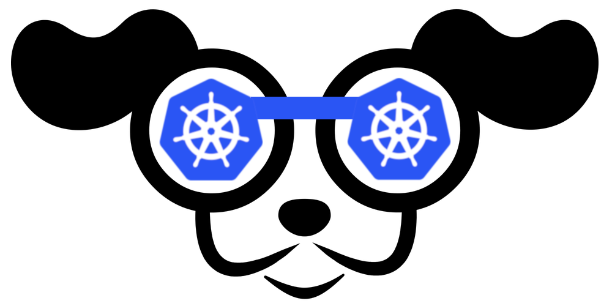
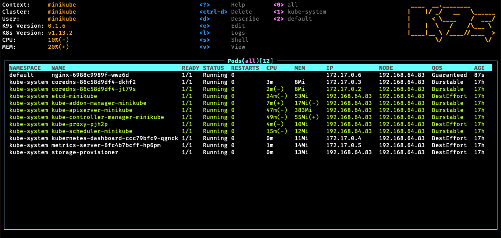
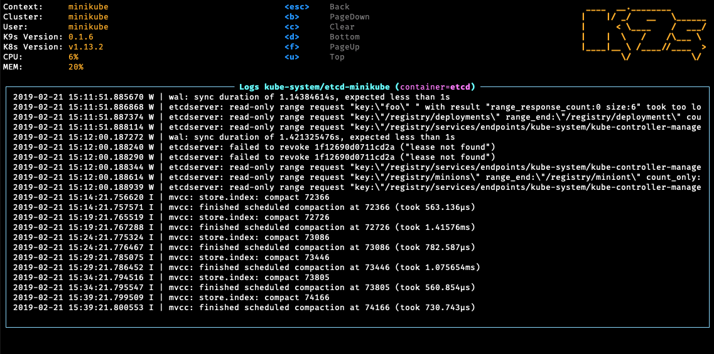
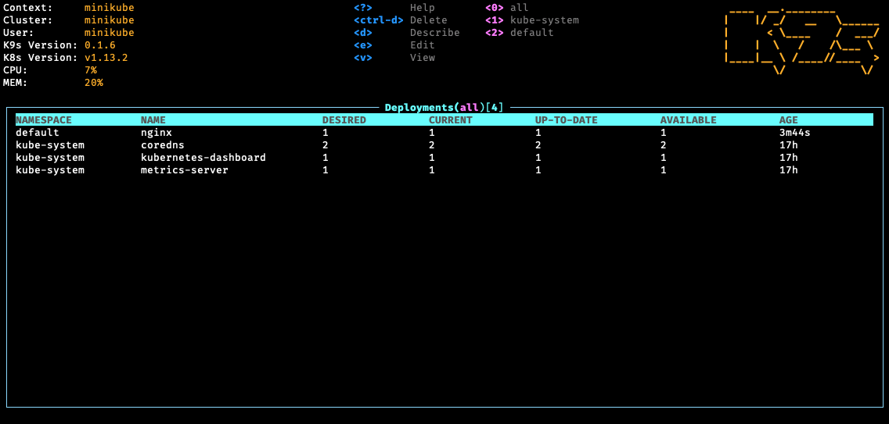
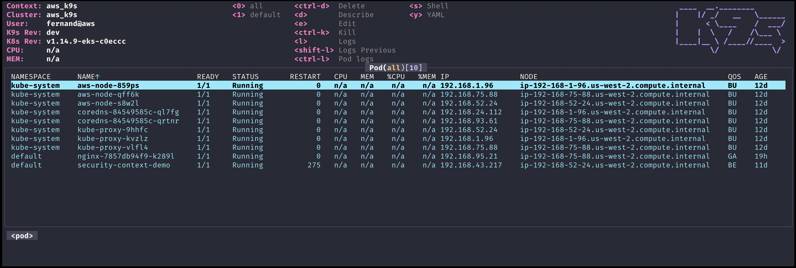
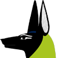

## K9s - Kubernetes CLI To Manage Your Clusters In Style!

K9s provides a terminal UI to interact with your Kubernetes clusters.
The aim of this project is to make it easier to navigate, observe and manage
your applications in the wild. K9s continually watches Kubernetes
for changes and offers subsequent commands to interact with your observed resources.

---

## Note...

K9s is not pimped out by a big corporation with deep pockets.
It is a complex OSS project that demands a lot of my time to maintain and support.
K9s will always remain OSS and therefore free! That said, if you feel k9s makes your day to day Kubernetes journey a tad brighter, saves you time and makes you more productive, please consider [sponsoring us!](https://github.com/sponsors/derailed)
Your donations will go a long way in keeping our servers lights on and beers in our fridge!

**Thank you!**

---

[](https://goreportcard.com/report/github.com/derailed/k9s)
[](https://golangci.com/r/github.com/derailed/k9s)
[](https://codebeat.co/projects/github-com-derailed-k9s-master)
[](https://travis-ci.com/derailed/k9s)
[](https://quay.io/repository/derailed/k9s)
[](https://github.com/derailed/k9s/releases)
[](https://github.com/mum4k/termdash/blob/master/LICENSE)
[](https://github.com/derailed/k9s/releases)

---

## Screenshots

1. Pods
      
2. Logs
      
3. Deployments
      

---

## Demo Videos/Recordings

* [K9s v0.30.0 Sneak peek](https://youtu.be/mVBc1XneRJ4)
* [Vulnerability Scans](https://youtu.be/ULkl0MsaidU)
* [K9s v0.29.0](https://youtu.be/oiU3wmoAkBo)
* [K9s v0.21.3](https://youtu.be/wG8KCwDAhnw)
* [K9s v0.19.X](https://youtu.be/kj-WverKZ24)
* [K9s v0.18.0](https://www.youtube.com/watch?v=zMnD5e53yRw)
* [K9s v0.17.0](https://www.youtube.com/watch?v=7S33CNLAofk&feature=youtu.be)
* [K9s Pulses](https://asciinema.org/a/UbXKPal6IWpTaVAjBBFmizcGN)
* [K9s v0.15.1](https://youtu.be/7Fx4XQ2ftpM)
* [K9s v0.13.0](https://www.youtube.com/watch?v=qaeR2iK7U0o&t=15s)
* [K9s v0.9.0](https://www.youtube.com/watch?v=bxKfqumjW4I)
* [K9s v0.7.0 Features](https://youtu.be/83jYehwlql8)
* [K9s v0 Demo](https://youtu.be/k7zseUhaXeU)

---

## Documentation

Please refer to our [K9s documentation](https://k9scli.io) site for installation, usage, customization and tips.

## Slack Channel

Wanna discuss K9s features with your fellow `K9sers` or simply show your support for this tool?

* Channel: [K9sersSlack](https://k9sers.slack.com/)
* Invite: [K9slackers Invite](https://join.slack.com/t/k9sers/shared_invite/enQtOTA5MDEyNzI5MTU0LWQ1ZGI3MzliYzZhZWEyNzYxYzA3NjE0YTk1YmFmNzViZjIyNzhkZGI0MmJjYzhlNjdlMGJhYzE2ZGU1NjkyNTM)

## Installation

K9s is available on Linux, macOS and Windows platforms.
Binaries for Linux, Windows and Mac are available as tarballs in the [release page](https://github.com/derailed/k9s/releases).

* Via [Homebrew](https://brew.sh/) for macOS or Linux

   ```shell
   brew install derailed/k9s/k9s
   ```

* Via [MacPorts](https://www.macports.org)

   ```shell
   sudo port install k9s
   ```

* Via [snap](https://snapcraft.io/k9s) for Linux

  ```shell
  snap install k9s --devmode
  ```

* On Arch Linux

  ```shell
  pacman -S k9s
  ```

* On OpenSUSE Linux distribution

  ```shell
  zypper install k9s
  ```

* On FreeBSD

  ```shell
  pkg install k9s
  ```

* On Ubuntu

  ```shell
  wget https://github.com/derailed/k9s/releases/download/v0.32.7/k9s_linux_amd64.deb && apt install ./k9s_linux_amd64.deb && rm k9s_linux_amd64.deb
  ```

* Via [Winget](https://github.com/microsoft/winget-cli) for Windows

  ```shell
  winget install k9s
  ```

* Via [Scoop](https://scoop.sh) for Windows

  ```shell
  scoop install k9s
  ```

* Via [Chocolatey](https://chocolatey.org/packages/k9s) for Windows

  ```shell
  choco install k9s
  ```

* Via a GO install

  ```shell
  # NOTE: The dev version will be in effect!
  go install github.com/derailed/k9s@latest
  ```

* Via [Webi](https://webinstall.dev) for Linux and macOS

  ```shell
  curl -sS https://webinstall.dev/k9s | bash
  ```

* Via [pkgx](https://pkgx.dev/pkgs/k9scli.io/) for Linux and macOS

  ```shell
  pkgx k9s
  ```

* Via [Webi](https://webinstall.dev) for Windows

  ```shell
  curl.exe -A MS https://webinstall.dev/k9s | powershell
  ```

* As a [Docker Desktop Extension](https://docs.docker.com/desktop/extensions/) (for the Docker Desktop built in Kubernetes Server)

  ```shell
  docker extension install spurin/k9s-dd-extension:latest
  ```

---

## Building From Source

 K9s is currently using GO v1.23.X or above.
 In order to build K9s from source you must:

 1. Clone the repo
 2. Build and run the executable

      ```shell
      make build && ./execs/k9s
      ```

---

## Running with Docker

### Running the official Docker image

  You can run k9s as a Docker container by mounting your `KUBECONFIG`:

  ```shell
  docker run --rm -it -v $KUBECONFIG:/root/.kube/config quay.io/derailed/k9s
  ```

  For default path it would be:

  ```shell
  docker run --rm -it -v ~/.kube/config:/root/.kube/config quay.io/derailed/k9s
  ```

### Building your own Docker image

  You can build your own Docker image of k9s from the [Dockerfile](Dockerfile) with the following:

  ```shell
  docker build -t k9s-docker:v0.0.1 .
  ```

  You can get the latest stable `kubectl` version and pass it to the `docker build` command with the `--build-arg` option.
  You can use the `--build-arg` option to pass any valid `kubectl` version (like `v1.18.0` or `v1.19.1`).

  ```shell
  KUBECTL_VERSION=$(make kubectl-stable-version 2>/dev/null)
  docker build --build-arg KUBECTL_VERSION=${KUBECTL_VERSION} -t k9s-docker:0.1 .
  ```

  Run your container:

  ```shell
  docker run --rm -it -v ~/.kube/config:/root/.kube/config k9s-docker:0.1
  ```

---

## PreFlight Checks

* K9s uses 256 colors terminal mode. On `Nix system make sure TERM is set accordingly.

    ```shell
    export TERM=xterm-256color
    ```

* In order to issue resource edit commands make sure your EDITOR and KUBE_EDITOR env vars are set.

    ```shell
    # Kubectl edit command will use this env var.
    export KUBE_EDITOR=my_fav_editor
    ```

* K9s prefers recent kubernetes versions ie 1.28+

---

## K8S Compatibility Matrix

|         k9s        | k8s client |
| ------------------ | ---------- |
|     >= v0.27.0     |   1.26.1   |
| v0.26.7 - v0.26.6  |   1.25.3   |
| v0.26.5 - v0.26.4  |   1.25.1   |
| v0.26.3 - v0.26.1  |   1.24.3   |
| v0.26.0 - v0.25.19 |   1.24.2   |
| v0.25.18 - v0.25.3 |   1.22.3   |
| v0.25.2 - v0.25.0  |   1.22.0   |
|      <= v0.24      |   1.21.3   |

---

## The Command Line

```shell
# List current version
k9s version

# To get info about K9s runtime (logs, configs, etc..)
k9s info

# List all available CLI options
k9s help

# To run K9s in a given namespace
k9s -n mycoolns

# Start K9s in an existing KubeConfig context
k9s --context coolCtx

# Start K9s in readonly mode - with all cluster modification commands disabled
k9s --readonly
```

## Logs And Debug Logs

Given the nature of the ui k9s does produce logs to a specific location.
To view the logs and turn on debug mode, use the following commands:

```shell
# Find out where the logs are stored
k9s info
```

```text
 ____  __.________
|    |/ _/   __   \______
|      < \____    /  ___/
|    |  \   /    /\___ \
|____|__ \ /____//____  >
        \/            \/

Version:           vX.Y.Z
Config:            /Users/fernand/.config/k9s/config.yaml
Logs:              /Users/fernand/.local/state/k9s/k9s.log
Dumps dir:         /Users/fernand/.local/state/k9s/screen-dumps
Benchmarks dir:    /Users/fernand/.local/state/k9s/benchmarks
Skins dir:         /Users/fernand/.local/share/k9s/skins
Contexts dir:      /Users/fernand/.local/share/k9s/clusters
Custom views file: /Users/fernand/.local/share/k9s/views.yaml
Plugins file:      /Users/fernand/.local/share/k9s/plugins.yaml
Hotkeys file:      /Users/fernand/.local/share/k9s/hotkeys.yaml
Alias file:        /Users/fernand/.local/share/k9s/aliases.yaml
```

### View K9s logs

```shell
tail -f /Users/fernand/.local/data/k9s/k9s.log
```

### Start K9s in debug mode

```shell
k9s -l debug
```

### Customize logs destination

You can override the default log file destination either with the `--logFile` argument:

```shell
k9s --logFile /tmp/k9s.log
less /tmp/k9s.log
```

Or through the `K9S_LOGS_DIR` environment variable:

```shell
K9S_LOGS_DIR=/var/log k9s
less /var/log/k9s.log
```

## Key Bindings

K9s uses aliases to navigate most K8s resources.

| Action                                                                          | Command                       | Comment                                                                |
|---------------------------------------------------------------------------------|-------------------------------|------------------------------------------------------------------------|
| Show active keyboard mnemonics and help                                         | `?`                           |                                                                        |
| Show all available resource alias                                               | `ctrl-a`                      |                                                                        |
| To bail out of K9s                                                              | `:quit`, `:q`, `ctrl-c`       |                                                                        |
| To go up/back to the previous view                                              | `esc`                         | If you have crumbs on, this will go to the previous one                |
| View a Kubernetes resource using singular/plural or short-name                  | `:`pod⏎                       | accepts singular, plural, short-name or alias ie pod or pods           |
| View a Kubernetes resource in a given namespace                                 | `:`pod ns-x⏎                  |                                                                        |
| View filtered pods (New v0.30.0!)                                               | `:`pod /fred⏎                 | View all pods filtered by fred                                         |
| View labeled pods (New v0.30.0!)                                                | `:`pod app=fred,env=dev⏎      | View all pods with labels matching app=fred and env=dev                |
| View pods in a given context (New v0.30.0!)                                     | `:`pod @ctx1⏎                 | View all pods in context ctx1. Switches out your current k9s context!  |
| Filter out a resource view given a filter                                       | `/`filter⏎                    | Regex2 supported ie `fred|blee` to filter resources named fred or blee |
| Inverse regex filter                                                            | `/`! filter⏎                  | Keep everything that *doesn't* match.                                  |
| Filter resource view by labels                                                  | `/`-l label-selector⏎         |                                                                        |
| Fuzzy find a resource given a filter                                            | `/`-f filter⏎                 |                                                                        |
| Bails out of view/command/filter mode                                           | `<esc>`                       |                                                                        |
| Key mapping to describe, view, edit, view logs,...                              | `d`,`v`, `e`, `l`,...         |                                                                        |
| To view and switch to another Kubernetes context (Pod view)                     | `:`ctx⏎                       |                                                                        |
| To view and switch directly to another Kubernetes context (Last used view)      | `:`ctx context-name⏎          |                                                                        |
| To view and switch to another Kubernetes namespace                              | `:`ns⏎                        |                                                                        |
| To view all saved resources                                                     | `:`screendump or sd⏎          |                                                                        |
| To delete a resource (TAB and ENTER to confirm)                                 | `ctrl-d`                      |                                                                        |
| To kill a resource (no confirmation dialog, equivalent to kubectl delete --now) | `ctrl-k`                      |                                                                        |
| Launch pulses view                                                              | `:`pulses or pu⏎              |                                                                        |
| Launch XRay view                                                                | `:`xray RESOURCE [NAMESPACE]⏎ | RESOURCE can be one of po, svc, dp, rs, sts, ds, NAMESPACE is optional |
| Launch Popeye view                                                              | `:`popeye or pop⏎             | See [popeye](#popeye)                                                  |

---

## K9s Configuration

  K9s keeps its configurations as YAML files inside of a `k9s` directory and the location depends on your operating system. K9s leverages [XDG](https://specifications.freedesktop.org/basedir-spec/basedir-spec-latest.html) to load its various configurations files. For information on the default locations for your OS please see [this link](https://github.com/adrg/xdg/blob/master/README.md). If you are still confused a quick `k9s info` will reveal where k9s is loading its configurations from. Alternatively, you can set `K9S_CONFIG_DIR` to tell K9s the directory location to pull its configurations from.

  | Unix            | macOS                              | Windows               |
  |-----------------|------------------------------------|-----------------------|
  | `~/.config/k9s` | `~/Library/Application Support/k9s` | `%LOCALAPPDATA%\k9s`  |

  > NOTE: This is still in flux and will change while in pre-release stage!

You can now override the context portForward default address configuration by setting an env variable that can override all clusters portForward local address using `K9S_DEFAULT_PF_ADDRESS=a.b.c.d`

  ```yaml
  # $XDG_CONFIG_HOME/k9s/config.yaml
  k9s:
    # Enable periodic refresh of resource browser windows. Default false
    liveViewAutoRefresh: false
    # The path to screen dump. Default: '%temp_dir%/k9s-screens-%username%' (k9s info)
    screenDumpDir: /tmp/dumps
    # Represents ui poll intervals. Default 2secs
    refreshRate: 2
    # Number of retries once the connection to the api-server is lost. Default 15.
    maxConnRetry: 5
    # Indicates whether modification commands like delete/kill/edit are disabled. Default is false
    readOnly: false
    # Toggles whether k9s should exit when CTRL-C is pressed. When set to true, you will need to exit k9s via the :quit command. Default is false.
    noExitOnCtrlC: false
    #UI settings
    ui:
      # Enable mouse support. Default false
      enableMouse: false
      # Set to true to hide K9s header. Default false
      headless: false
      # Set to true to hide the K9S logo Default false
      logoless: false
      # Set to true to hide K9s crumbs. Default false
      crumbsless: false
      noIcons: false
      # Toggles reactive UI. This option provide for watching on disk artifacts changes and update the UI live Defaults to false.
      reactive: false
      # By default all contexts will use the dracula skin unless explicitly overridden in the context config file.
      skin: dracula # => assumes the file skins/dracula.yaml is present in the  $XDG_DATA_HOME/k9s/skins directory
      # Allows to set certain views default fullscreen mode. (yaml, helm history, describe, value_extender, details, logs) Default false
      defaultsToFullScreen: false
    # Toggles icons display as not all terminal support these chars.
    noIcons: false
    # Toggles whether k9s should check for the latest revision from the GitHub repository releases. Default is false.
    skipLatestRevCheck: false
    # When altering kubeconfig or using multiple kube configs, k9s will clean up clusters configurations that are no longer in use. Setting this flag to true will keep k9s from cleaning up inactive cluster configs. Defaults to false.
    keepMissingClusters: false
    # Logs configuration
    logger:
      # Defines the number of lines to return. Default 100
      tail: 200
      # Defines the total number of log lines to allow in the view. Default 1000
      buffer: 500
      # Represents how far to go back in the log timeline in seconds. Setting to -1 will tail logs. Default is -1.
      sinceSeconds: 300 # => tail the last 5 mins.
      # Toggles log line wrap. Default false
      textWrap: false
      # Toggles log line timestamp info. Default false
      showTime: false
    # Provide shell pod customization when nodeShell feature gate is enabled!
    shellPod:
      # The shell pod image to use.
      image: killerAdmin
      # The namespace to launch to shell pod into.
      namespace: default
      # The resource limit to set on the shell pod.
      limits:
        cpu: 100m
        memory: 100Mi
      # Enable TTY
      tty: true
  ```

---

## <a id="popeye"></a>Popeye Configuration

K9s has integration with [Popeye](https://popeyecli.io/), which is a Kubernetes cluster sanitizer.  Popeye itself uses a configuration called `spinach.yml`, but when integrating with K9s the cluster-specific file should be name `$XDG_CONFIG_HOME/share/k9s/clusters/clusterX/contextY/spinach.yml`.  This allows you to have a different spinach config per cluster.

---

## Node Shell

By enabling the nodeShell feature gate on a given cluster, K9s allows you to shell into your cluster nodes. Once enabled, you will have a new `s` for `shell` menu option while in node view. K9s will launch a pod on the selected node using a special k9s_shell pod. Furthermore, you can refine your shell pod by using a custom docker image preloaded with the shell tools you love. By default k9s uses a BusyBox image, but you can configure it as follows:

Alternatively, you can now override the context configuration by setting an env variable that can override all clusters node shell gate using `K9S_FEATURE_GATE_NODE_SHELL=true|false`

```yaml
# $XDG_CONFIG_HOME/k9s/config.yaml
k9s:
  # You can also further tune the shell pod specification
  shellPod:
    image: cool_kid_admin:42
    namespace: blee
    limits:
      cpu: 100m
      memory: 100Mi
```

Then in your cluster configuration file...

```yaml
# $XDG_DATA_HOME/k9s/clusters/cluster-1/context-1
k9s:
  cluster: cluster-1
  readOnly: false
  namespace:
    active: default
    lockFavorites: false
    favorites:
    - kube-system
    - default
  view:
    active: po
  featureGates:
    nodeShell: true # => Enable this feature gate to make nodeShell available on this cluster
  portForwardAddress: localhost
```

---

## Command Aliases

In K9s, you can define your very own command aliases (shortnames) to access your resources. In your `$HOME/.config/k9s` define a file called `aliases.yaml`.
A K9s alias defines pairs of alias:gvr. A gvr (Group/Version/Resource) represents a fully qualified Kubernetes resource identifier. Here is an example of an alias file:

```yaml
#  $XDG_DATA_HOME/k9s/aliases.yaml
aliases:
  pp: v1/pods
  crb: rbac.authorization.k8s.io/v1/clusterrolebindings
  # As of v0.30.0 you can also refer to another command alias...
  fred: pod fred app=blee # => view pods in namespace fred with labels matching app=blee
```

Using this aliases file, you can now type `:pp` or `:crb` or `:fred` to activate their respective commands.

---

## HotKey Support

Entering the command mode and typing a resource name or alias, could be cumbersome for navigating thru often used resources.
We're introducing hotkeys that allow users to define their own key combination to activate their favorite resource views.

Additionally, you can define context specific hotkeys by add a context level configuration file in `$XDG_DATA_HOME/k9s/clusters/clusterX/contextY/hotkeys.yaml`

In order to surface hotkeys globally please follow these steps:

1. Create a file named `$XDG_CONFIG_HOME/k9s/hotkeys.yaml`
2. Add the following to your `hotkeys.yaml`. You can use resource name/short name to specify a command ie same as typing it while in command mode.

      ```yaml
      #  $XDG_CONFIG_HOME/k9s/hotkeys.yaml
      hotKeys:
        # Hitting Shift-0 navigates to your pod view
        shift-0:
          shortCut:    Shift-0
          description: Viewing pods
          command:     pods
        # Hitting Shift-1 navigates to your deployments
        shift-1:
          shortCut:    Shift-1
          description: View deployments
          command:     dp
        # Hitting Shift-2 navigates to your xray deployments
        shift-2:
          shortCut:    Shift-2
          description: Xray Deployments
          command:     xray deploy
        # Hitting Shift-S view the resources in the namespace of your current selection
        shift-s:
          shortCut:    Shift-S
          override:    true # => will override the default shortcut related action if set to true (default to false)
          description: Namespaced resources
          command:     "$RESOURCE_NAME $NAMESPACE"
          keepHistory: true # whether you can return to the previous view
      ```

 Not feeling so hot? Your custom hotkeys will be listed in the help view `?`.
 Also your hotkeys file will be automatically reloaded so you can readily use your hotkeys as you define them.

 You can choose any keyboard shortcuts that make sense to you, provided they are not part of the standard K9s shortcuts list.

 Similarly, referencing environment variables in hotkeys is also supported. The available environment variables can refer to the description in the [Plugins](#plugins) section.

> NOTE: This feature/configuration might change in future releases!

---

## Port Forwarding over websockets

K9s follows `kubectl` feature flag environment variables to enable/disable port-forwarding over websockets. (default enabled in >1.30)
To disable Websocket support, set `KUBECTL_PORT_FORWARD_WEBSOCKETS=false`

---

## FastForwards

As of v0.25.0, you can leverage the `FastForwards` feature to tell K9s how to default port-forwards. In situations where you are dealing with multiple containers or containers exposing multiple ports, it can be cumbersome to specify the desired port-forward from the dialog as in most cases, you already know which container/port tuple you desire. For these use cases, you can now annotate your manifests with the following annotations:

@ `k9scli.io/auto-port-forwards`
  activates one or more port-forwards directly bypassing the port-forward dialog all together.
@ `k9scli.io/port-forwards`
  pre-selects one or more port-forwards when launching the port-forward dialog.

The annotation value takes on the shape `container-name::[local-port:]container-port`

> NOTE: for either cases above you can specify the container port by name or number in your annotation!

### Example

```yaml
# Pod fred
apiVersion: v1
kind: Pod
metadata:
  name: fred
  annotations:
    k9scli.io/auto-port-forwards: zorg::5556        # => will default to container zorg port 5556 and local port 5566. No port-forward dialog will be shown.
    # Or...
    k9scli.io/port-forwards: bozo::9090:p1          # => launches the port-forward dialog selecting default port-forward on container bozo port named p1(8081)
                                                    # mapping to local port 9090.
    ...
spec:
  containers:
  - name: zorg
    ports:
    - name: p1
      containerPort: 5556
    ...
  - name: bozo
    ports:
    - name: p1
      containerPort: 8081
    - name: p2
      containerPort: 5555
    ...
```

The annotation value must specify a container to forward to as well as a local port and container port. The container port may be specified as either a port number or port name. If the local port is omitted then the local port will default to the container port number. Here are a few examples:

1. bozo::http      - creates a pf on container `bozo` with port name http. If http specifies port number 8080 then the local port will be 8080 as well.
2. bozo::9090:http - creates a pf on container `bozo` mapping local port 9090->http(8080)
3. bozo::9090:8080 - creates a pf on container `bozo` mapping local port 9090->8080

---

## Resource Custom Columns

[SneakCast v0.17.0 on The Beach! - Yup! sound is sucking but what a setting!](https://youtu.be/7S33CNLAofk)

You can change which columns shows up for a given resource via custom views. To surface this feature, you will need to create a new configuration file, namely `$XDG_CONFIG_HOME/k9s/views.yaml`. This file leverages GVR (Group/Version/Resource) to configure the associated table view columns. If no GVR is found for a view the default rendering will take over (ie what we have now). Going wide will add all the remaining columns that are available on the given resource after your custom columns. To boot, you can edit your views config file and tune your resources views live!

> NOTE: This is experimental and will most likely change as we iron this out!

Here is a sample views configuration that customize a pods and services views.

```yaml
# $XDG_CONFIG_HOME/k9s/views.yaml
views:
  v1/pods:
    columns:
      - AGE
      - NAMESPACE
      - NAME
      - IP
      - NODE
      - STATUS
      - READY
  v1/services:
    columns:
      - AGE
      - NAMESPACE
      - NAME
      - TYPE
      - CLUSTER-IP
```

---

## Plugins

K9s allows you to extend your command line and tooling by defining your very own cluster commands via plugins. K9s will look at `$XDG_CONFIG_HOME/k9s/plugins.yaml` to locate all available plugins.

A plugin is defined as follows:

* Shortcut option represents the key combination a user would type to activate the plugin. Valid values are [a-z], Shift-[A-Z], Ctrl-[A-Z].
* Override option make that the default action related to the shortcut will be overridden by the plugin
* Confirm option (when enabled) lets you see the command that is going to be executed and gives you an option to confirm or prevent execution
* Description will be printed next to the shortcut in the k9s menu
* Scopes defines a collection of resources names/short-names for the views associated with the plugin. You can specify `all` to provide this shortcut for all views.
* Command represents ad-hoc commands the plugin runs upon activation
* Background specifies whether or not the command runs in the background
* Args specifies the various arguments that should apply to the command above
* OverwriteOutput boolean option allows plugin developers to provide custom messages on plugin stdout execution. See example in [#2644](https://github.com/derailed/k9s/pull/2644)
* Dangerous boolean option enables disabling the plugin when read-only mode is set. See [#2604](https://github.com/derailed/k9s/issues/2604)

K9s does provide additional environment variables for you to customize your plugins arguments. Currently, the available environment variables are as follows:

* `$RESOURCE_GROUP` -- the selected resource group
* `$RESOURCE_VERSION` -- the selected resource api version
* `$RESOURCE_NAME` -- the selected resource name
* `$NAMESPACE` -- the selected resource namespace
* `$NAME` -- the selected resource name
* `$CONTAINER` -- the current container if applicable
* `$FILTER` -- the current filter if any
* `$KUBECONFIG` -- the KubeConfig location.
* `$CLUSTER` the active cluster name
* `$CONTEXT` the active context name
* `$USER` the active user
* `$GROUPS` the active groups
* `$POD` while in a container view
* `$COL-<RESOURCE_COLUMN_NAME>` use a given column name for a viewed resource. Must be prefixed by `COL-`!

Curly braces can be used to embed an environment variable inside another string, or if the column name contains special characters. (e.g. `${NAME}-example` or `${COL-%CPU/L}`)

### Plugin Example

This defines a plugin for viewing logs on a selected pod using `ctrl-l` as shortcut.

```yaml
#  $XDG_DATA_HOME/k9s/plugins.yaml
plugins:
  # Defines a plugin to provide a `ctrl-l` shortcut to tail the logs while in pod view.
  fred:
    shortCut: Ctrl-L
    override: false
    overwriteOutput: false
    confirm: false
    dangerous: false
    description: Pod logs
    scopes:
    - pods
    command: kubectl
    background: false
    args:
    - logs
    - -f
    - $NAME
    - -n
    - $NAMESPACE
    - --context
    - $CONTEXT
```

> NOTE: This is an experimental feature! Options and layout may change in future K9s releases as this feature solidifies.

---

## Benchmark Your Applications

K9s integrates [Hey](https://github.com/rakyll/hey) from the brilliant and super talented [Jaana Dogan](https://github.com/rakyll). `Hey` is a CLI tool to benchmark HTTP endpoints similar to AB bench. This preliminary feature currently supports benchmarking port-forwards and services (Read the paint on this is way fresh!).

To setup a port-forward, you will need to navigate to the PodView, select a pod and a container that exposes a given port. Using `SHIFT-F` a dialog comes up to allow you to specify a local port to forward. Once acknowledged, you can navigate to the PortForward view (alias `pf`) listing out your active port-forwards. Selecting a port-forward and using `CTRL-B` will run a benchmark on that HTTP endpoint. To view the results of your benchmark runs, go to the Benchmarks view (alias `be`). You should now be able to select a benchmark and view the run stats details by pressing `<ENTER>`. NOTE: Port-forwards only last for the duration of the K9s session and will be terminated upon exit.

Initially, the benchmarks will run with the following defaults:

* Concurrency Level: 1
* Number of Requests: 200
* HTTP Verb: GET
* Path: /

The PortForward view is backed by a new K9s config file namely: `$XDG_DATA_HOME/k9s/clusters/clusterX/contextY/benchmarks.yaml`. Each cluster you connect to will have its own bench config file, containing the name of the K8s context for the cluster. Changes to this file should automatically update the PortForward view to indicate how you want to run your benchmarks.

Benchmarks result reports are stored in `$XDG_STATE_HOME/k9s/clusters/clusterX/contextY`

Here is a sample benchmarks.yaml configuration. Please keep in mind this file will likely change in subsequent releases!

```yaml
# This file resides in  $XDG_DATA_HOME/k9s/clusters/clusterX/contextY/benchmarks.yaml
benchmarks:
  # Indicates the default concurrency and number of requests setting if a container or service rule does not match.
  defaults:
    # One concurrent connection
    concurrency: 1
    # Number of requests that will be sent to an endpoint
    requests: 500
  containers:
    # Containers section allows you to configure your http container's endpoints and benchmarking settings.
    # NOTE: the container ID syntax uses namespace/pod-name:container-name
    default/nginx:nginx:
      # Benchmark a container named nginx using POST HTTP verb using http://localhost:port/bozo URL and headers.
      concurrency: 1
      requests: 10000
      http:
        path: /bozo
        method: POST
        body:
          {"fred":"blee"}
        header:
          Accept:
            - text/html
          Content-Type:
            - application/json
  services:
    # Similarly you can Benchmark an HTTP service exposed either via NodePort, LoadBalancer types.
    # Service ID is ns/svc-name
    default/nginx:
      # Set the concurrency level
      concurrency: 5
      # Number of requests to be sent
      requests: 500
      http:
        method: GET
        # This setting will depend on whether service is NodePort or LoadBalancer. NodePort may require vendor port tunneling setting.
        # Set this to a node if NodePort or LB if applicable. IP or dns name.
        host: A.B.C.D
        path: /bumblebeetuna
      auth:
        user: jean-baptiste-emmanuel
        password: Zorg!
```

---

## K9s RBAC FU

On RBAC enabled clusters, you would need to give your users/groups capabilities so that they can use K9s to explore their Kubernetes cluster. K9s needs minimally read privileges at both the cluster and namespace level to display resources and metrics.

These rules below are just suggestions. You will need to customize them based on your environment policies. If you need to edit/delete resources extra Fu will be necessary.

> NOTE! Cluster/Namespace access may change in the future as K9s evolves.
> NOTE! We expect K9s to keep running even in atrophied clusters/namespaces. Please file issues if this is not the case!

### Cluster RBAC scope

```yaml
---
# K9s Reader ClusterRole
kind: ClusterRole
apiVersion: rbac.authorization.k8s.io/v1
metadata:
  name: k9s
rules:
  # Grants RO access to cluster resources node and namespace
  - apiGroups: [""]
    resources: ["nodes", "namespaces"]
    verbs: ["get", "list", "watch"]
  # Grants RO access to RBAC resources
  - apiGroups: ["rbac.authorization.k8s.io"]
    resources: ["clusterroles", "roles", "clusterrolebindings", "rolebindings"]
    verbs: ["get", "list", "watch"]
  # Grants RO access to CRD resources
  - apiGroups: ["apiextensions.k8s.io"]
    resources: ["customresourcedefinitions"]
    verbs: ["get", "list", "watch"]
  # Grants RO access to metric server (if present)
  - apiGroups: ["metrics.k8s.io"]
    resources: ["nodes", "pods"]
    verbs: ["get", "list", "watch"]

---
# Sample K9s user ClusterRoleBinding
apiVersion: rbac.authorization.k8s.io/v1
kind: ClusterRoleBinding
metadata:
  name: k9s
subjects:
  - kind: User
    name: fernand
    apiGroup: rbac.authorization.k8s.io
roleRef:
  kind: ClusterRole
  name: k9s
  apiGroup: rbac.authorization.k8s.io
```

### Namespace RBAC scope

If your users are constrained to certain namespaces, K9s will need to following role to enable read access to namespaced resources.

```yaml
---
# K9s Reader Role (default namespace)
kind: Role
apiVersion: rbac.authorization.k8s.io/v1
metadata:
  name: k9s
  namespace: default
rules:
  # Grants RO access to most namespaced resources
  - apiGroups: ["", "apps", "autoscaling", "batch", "extensions"]
    resources: ["*"]
    verbs: ["get", "list", "watch"]
  # Grants RO access to metric server
  - apiGroups: ["metrics.k8s.io"]
    resources: ["pods", "nodes"]
    verbs:
      - get
      - list
      - watch

---
# Sample K9s user RoleBinding
apiVersion: rbac.authorization.k8s.io/v1
kind: RoleBinding
metadata:
  name: k9s
  namespace: default
subjects:
  - kind: User
    name: fernand
    apiGroup: rbac.authorization.k8s.io
roleRef:
  kind: Role
  name: k9s
  apiGroup: rbac.authorization.k8s.io
```

---

## Skins

Example: Dracula Skin ;)



You can style K9s based on your own sense of look and style. Skins are YAML files, that enable a user to change the K9s presentation layer. See this repo `skins` directory for examples.
You can skin k9s by default by specifying a UI.skin attribute. You can also change K9s skins based on the context you are connecting too.
In this case, you can specify a skin field on your cluster config aka `skin: dracula` (just the name of the skin file without the extension!) and copy this repo
`skins/dracula.yaml` to `$XDG_CONFIG_HOME/k9s/skins/` directory.

In the case where your cluster spans several contexts, you can add a skin context configuration to your context configuration.
This is a collection of {context_name, skin} tuples (please see example below!)

Colors can be defined by name or using a hex representation. Of recent, we've added a color named `default` to indicate a transparent background color to preserve your terminal background color settings if so desired.

> NOTE: This is very much an experimental feature at this time, more will be added/modified if this feature has legs so thread accordingly!
> NOTE: Please see [K9s Skins](https://k9scli.io/topics/skins/) for a list of available colors.

To skin a specific context and provided the file `in_the_navy.yaml` is present in your skins directory.

```yaml
#  $XDG_DATA_HOME/k9s/clusters/clusterX/contextY/config.yaml
k9s:
  cluster: clusterX
  skin: in_the_navy
  readOnly: false
  namespace:
    active: default
    lockFavorites: false
    favorites:
    - kube-system
    - default
  view:
    active: po
  featureGates:
    nodeShell: false
  portForwardAddress: localhost
```

You can also specify a default skin for all contexts in the root k9s config file as so:

```yaml
#  $XDG_CONFIG_HOME/k9s/config.yaml
k9s:
  liveViewAutoRefresh: false
  screenDumpDir: /tmp/dumps
  refreshRate: 2
  maxConnRetry: 5
  readOnly: false
  noExitOnCtrlC: false
  ui:
    enableMouse: false
    headless: false
    logoless: false
    crumbsless: false
    noIcons: false
    # Toggles reactive UI. This option provide for watching on disk artifacts changes and update the UI live  Defaults to false.
    reactive: false
    # By default all contexts will use the dracula skin unless explicitly overridden in the context config file.
    skin: dracula # => assumes the file skins/dracula.yaml is present in the  $XDG_DATA_HOME/k9s/skins directory
    defaultsToFullScreen: false
  skipLatestRevCheck: false
  disablePodCounting: false
  shellPod:
    image: busybox
    namespace: default
    limits:
      cpu: 100m
      memory: 100Mi
  imageScans:
    enable: false
    exclusions:
      namespaces: []
      labels: {}
  logger:
    tail: 100
    buffer: 5000
    sinceSeconds: -1
    textWrap: false
    showTime: false
  thresholds:
    cpu:
      critical: 90
      warn: 70
    memory:
      critical: 90
      warn: 70
```

```yaml
# $XDG_DATA_HOME/k9s/skins/in_the_navy.yaml
# Skin InTheNavy!
k9s:
  # General K9s styles
  body:
    fgColor: dodgerblue
    bgColor: '#ffffff'
    logoColor: '#0000ff'
  # ClusterInfoView styles.
  info:
    fgColor: lightskyblue
    sectionColor: steelblue
  # Help panel styles
  help:
    fgColor: white
    bgColor: black
    keyColor: cyan
    numKeyColor: blue
    sectionColor: gray
  frame:
    # Borders styles.
    border:
      fgColor: dodgerblue
      focusColor: aliceblue
    # MenuView attributes and styles.
    menu:
      fgColor: darkblue
      keyColor: cornflowerblue
      # Used for favorite namespaces
      numKeyColor: cadetblue
    # CrumbView attributes for history navigation.
    crumbs:
      fgColor: white
      bgColor: steelblue
      activeColor: skyblue
    # Resource status and update styles
    status:
      newColor: '#00ff00'
      modifyColor: powderblue
      addColor: lightskyblue
      errorColor: indianred
      highlightcolor: royalblue
      killColor: slategray
      completedColor: gray
    # Border title styles.
    title:
      fgColor: aqua
      bgColor: white
      highlightColor: skyblue
      counterColor: slateblue
      filterColor: slategray
  views:
    # TableView attributes.
    table:
      fgColor: blue
      bgColor: darkblue
      cursorColor: aqua
      # Header row styles.
      header:
        fgColor: white
        bgColor: darkblue
        sorterColor: orange
    # YAML info styles.
    yaml:
      keyColor: steelblue
      colonColor: blue
      valueColor: royalblue
    # Logs styles.
    logs:
      fgColor: lightskyblue
      bgColor: black
      indicator:
        fgColor: dodgerblue
        bgColor: black
        toggleOnColor: limegreen
        toggleOffColor: gray
```

---

## Contributors

Without the contributions from these fine folks, this project would be a total dud!

<a href="https://github.com/derailed/k9s/graphs/contributors">
  
</a>

---

## Known Issues

This is still work in progress! If something is broken or there's a feature
that you want, please file an issue and if so inclined submit a PR!

K9s will most likely blow up if...

1. You're running older versions of Kubernetes. K9s works best on later Kubernetes versions.
2. You don't have enough RBAC fu to manage your cluster.

---

## ATTA Girls/Boys!

K9s sits on top of many open source projects and libraries. Our *sincere*
appreciations to all the OSS contributors that work nights and weekends
to make this project a reality!

---

## Meet The Core Team!

If you have chops in GO and K8s and would like to offer your time to help maintain and enhance this project, please reach out to me.

* [Fernand Galiana](https://github.com/derailed)
  *   fernand@imhotep.io
  *  [@kitesurfer](https://twitter.com/kitesurfer?lang=en)

We always enjoy hearing from folks who benefit from our work!

## Contributions Guideline

* File an issue first prior to submitting a PR!
* Ensure all exported items are properly commented
* If applicable, submit a test suite against your PR

---

 &nbsp;© 2023 Imhotep Software LLC. All materials licensed under [Apache v2.0](http://www.apache.org/licenses/LICENSE-2.0)
