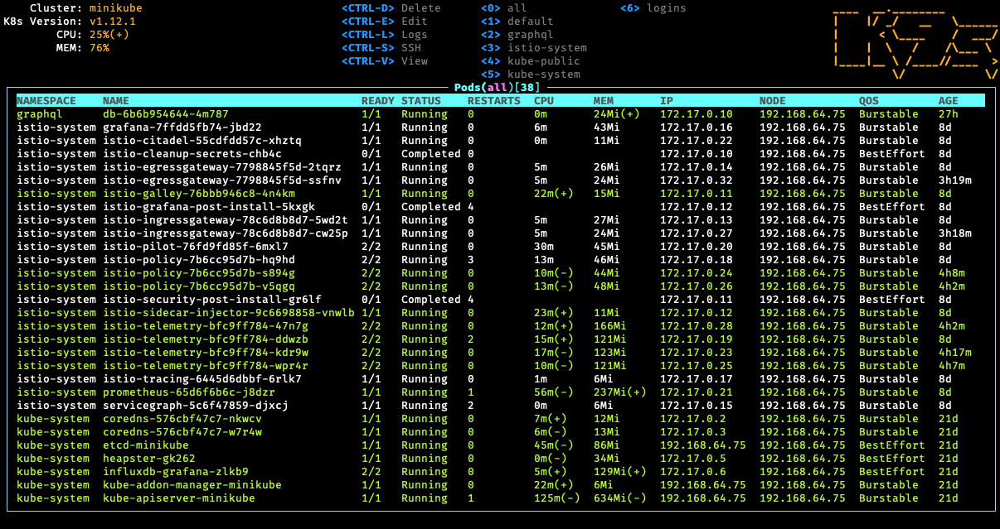
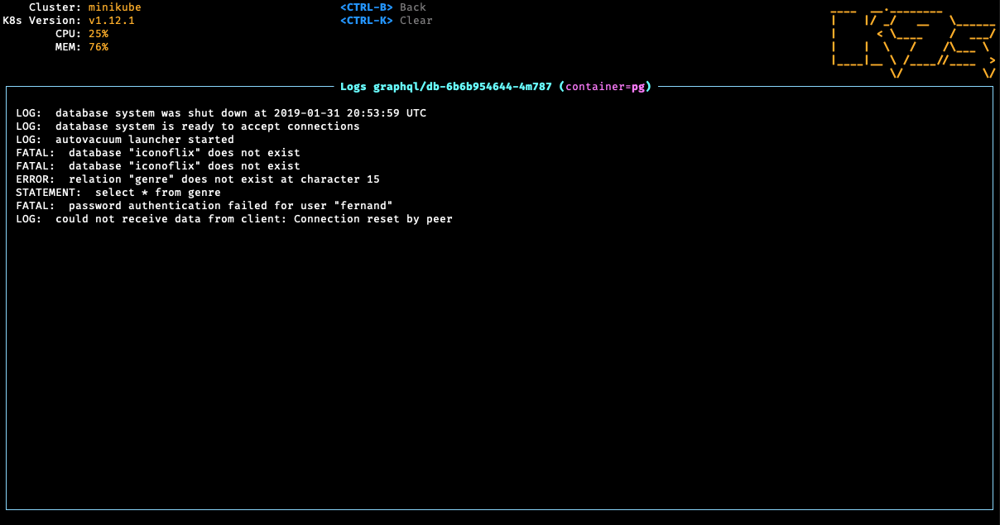

# K9s - Kubernetes CLI To Manage Your Clusters In Style!

K9s provides a curses based terminal UI to interact with your Kubernetes clusters.
The aim of this project is to make it easier to navigate, observe and manage
your applications. This command line app continually watches Kubernetes
for changes and offers subsequent commands to interact with observed resources.


<br/>

---

[](https://goreportcard.com/report/github.com/derailed/k9s)
[](https://travis-ci.com/derailed/k9s)

<br/>

---
## Installation

1. Homebrew (OSX)

```shell
brew tap derailed/k9s && brew install k9s
```

1. Binary Releases

- [Releases](https://github.com/derailed/k9s/releases)

1. Running from source

- You will need to use go 1.11+
- GO111MODULE=on

<br/>

---
## Command Line

```shell
# List all available CLI options
k9s -h
# To get info about K9s runtime (logs, configs, etc..)
k9s info
# To run K9s in a given namespace
k9s -n mybitchns
```

<br/>

---
## PreFlight Checks

* K9s uses 256 colors terminal mode. On `Nix system make sure TERM is set accordingly.

    ```shell
    export TERM=xterm-256color
    ```

* For clusters with many namespaces you can either edit ~/.k9s/config.yml or
  go to the namespace(ns) view to switch your default namespace to your namespace
  of choice using *Ctrl-S*witch. K9s keeps your top 10 favorite namespaces.
  Namespaces will get evicted from the top 10 list, based on your namespace
  switching frequency.


    ```yaml
    k9s:
      refreshRate:   5   # K9s refresh rate in secs
      logBufferSize: 200 # Size of the logs buffer. Try to keep a sensible default!
      namespace:
        active: myCoolNS # Current active namespace name
        favorites:       # List of your 10 most frequently used namespaces
        - myCoolNS1
        - myCoolNS2
        - all
        - default
        - kube-system
      view:
        active: po       # Active resource view
    ```

* K9s can use **$KUBECONFIG** env var to load cluster information. However we've
  seen hill effects of using this env with multiple files as setting the current
  context may not update the correct file when using this technique.


---
<br/>

---
## Usage

K9s uses 2 or 3 letters alias to navigate most K8s resource.

| Command           | Result                                             | Example          |
|-------------------|----------------------------------------------------|------------------|
| `:`alias`<ENTER>` | List a Kubernetes resource in the active namespace | `:po<ENTER>`     |
| '?'               | Show all command aliases                           |                  |
| `/`filter`ENTER`> | Filter out a resource view given a filter          | `/bumblebeetuna` |
| `<Esc>`           | Bails out of command mode                          |                  |
| `v`, `e`, `l`,... | Key mapping to view, edit, see logs, etc...        | `l` (view logs)  |
| `:`ctx`<ENTER>`   | To view and switch to another Kubernetes cluster   |                  |
| `q`, `Ctrl-c`     | To bail out of K9s                                 |                  |


<br/>

---
## Building From Source

K9s was built using go 1.11. In order to build K9 from source:

+ Clone the repo
+ Add the following command in your go.mod file
  ```text
  replace (
    github.com/derailed/k9s => MY_K9S_CLONED_REPO
  )
  ```
+ Build and run the executable
  ```shell
  go run main.go
  ```

<br/>

---
## Demo Video

+ [k9s Demo](https://youtu.be/k7zseUhaXeU)


<br/>

---
## Screen Shots

### Pod View



### Log View



<br/>

---
## Known Issues...

This initial drop is brittle. K9s will most likely blow up if...

+ K9s does not support multiple cluster config specified via KUBECONFIG env var
+ You don't have enough RBAC fu to manage your cluster
+ Your cluster does not run a metrics-server

<br/>

---
## Disclaimer

This is still work in progress! If there is enough interest in the Kubernetes
community, we will enhance per your recommendations/contributions. Also if you
dig this effort, please let us know that too!

<br/>

---
## ATTA Girls/Boys!

K9s sits on top of many of opensource projects and libraries. Our *sincere*
appreciations to all the OSS contributors that work nights and weekends
to make this project a reality!


<br/>

---
## Contact Information

+ **Email**:   fernand@imhotep.io
+ **Twitter**: [@kitesurfer](https://twitter.com/kitesurfer?lang=en)
+ **Web**:  [K9s](https://k9ss.io)

<br/>

---
 © 2018 Imhotep Software LLC.
All materials licensed under [Apache v2.0](http://www.apache.org/licenses/LICENSE-2.0)