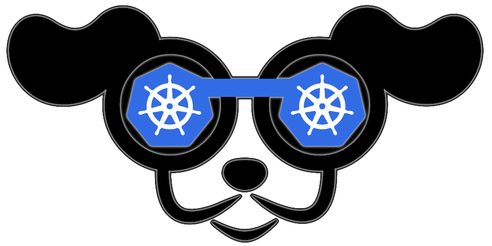

# K9s - Kubernetes CLI To Manage Your Clusters In Style!

K9s provides a curses based terminal UI to interact with your Kubernetes clusters.
The aim of this project is to make it easier to navigate, observe and manage
your applications in the wild. K9s continually watches Kubernetes
for changes and offers subsequent commands to interact with observed resources.

---

[](https://goreportcard.com/report/github.com/derailed/k9s)
[](https://travis-ci.com/derailed/k9s)
[](https://github.com/derailed/k9s/releases)
[](https://snapcraft.io/k9s)

---

## Installation

K9s is available on Linux, OSX and Windows platforms.

* Binaries for Linux, Windows and Mac are available as tarballs in the [release](https://github.com/derailed/k9s/releases) page.

* For OSX using Homebrew

   ```shell
   brew tap derailed/k9s && brew install k9s
   ```

* Building from source
   K9s was built using go 1.12 or above. In order to build K9 from source you must:
   1. Clone the repo
   2. Set env var *GO111MODULE=on*
   3. Add the following command in your go.mod file

      ```text
      replace (
        github.com/derailed/k9s => MY_K9S_CLONED_GIT_REPO
      )
      ```

   4. Build and run the executable

        ```shell
        go run main.go
        ```

---

## The Command Line

```shell
# List all available CLI options
k9s -h
# To get info about K9s runtime (logs, configs, etc..)
k9s info
# To run K9s in a given namespace
k9s -n mycoolns
# Start K9s in an existing KubeConfig context
k9s --context coolCtx
```

---

## PreFlight Checks

* K9s uses 256 colors terminal mode. On `Nix system make sure TERM is set accordingly.

    ```shell
    export TERM=xterm-256color
    ```

---

## K9s config file ($HOME/.k9s/config.yml)

  K9s keeps its configurations in a dot file in your home directory.

  > NOTE: This is still in flux and will change while in pre-release stage!

  ```yaml
  k9s:
    # Indicates api-server poll intervals.
    refreshRate: 2
    # Indicates log view maximum buffer size. Default 1k lines.
    logBufferSize: 200
    # Indicates how many lines of logs to retrieve from the api-server. Default 200 lines.
    logRequestSize: 200
    # Indicates the current kube context. Defaults to current context
    currentContext: minikube
    # Indicates the current kube cluster. Defaults to current context cluster
    currentCluster: minikube
    # Persists per cluster preferences for favorite namespaces and view.
    clusters:
      cooln:
        namespace:
          active: coolio
          favorites:
          - cassandra
          - default
        view:
          active: po
      minikube:
        namespace:
          active: all
          favorites:
          - all
          - kube-system
          - default
        view:
          active: dp
  ```

---

## Key Bindings

K9s uses aliases to navigate most K8s resources.

| Command               | Result                                             | Example                    |
|-----------------------|----------------------------------------------------|----------------------------|
| `:`alias`<ENTER>`     | View a Kubernetes resource                         | `:po<ENTER>`               |
| '?'                   | Show all command aliases                           | select+<ENTER> to view     |
| `/`filter`ENTER`>     | Filter out a resource view given a filter          | `/bumblebeetuna`           |
| `<Esc>`               | Bails out of command mode                          |                            |
| `d`,`v`, `e`, `l`,... | Key mapping to describe, view, edit, view logs,... | `d` (describes a resource) |
| `:`ctx`<ENTER>`       | To view and switch to another Kubernetes context   | `:`+`ctx`+`<ENTER>`        |
| `q`, `Ctrl-c`         | To bail out of K9s                                 |                            |

---

## Demo Video

1. [K9s Demo](https://youtu.be/k7zseUhaXeU)


## Screenshots

1. Pods
      
1. Logs
      
1. Deployments
      


---

## Known Issues

This initial drop is brittle. K9s will most likely blow up...

1. You're running older versions of Kubernetes. K9s works best Kubernetes 1.12+.
1. You don't have enough RBAC fu to manage your cluster (see RBAC section below).
1. Your cluster does not run a metric server.

---

## K9s RBAC FU

On RBAC enabled clusters, you would need to give your users/groups capabilities so that they can use K9s to explore Kubernetes cluster.
K9s needs minimaly read privileges at both the cluster and namespace level to display resources and metrics.

These rules below are just suggestions. You will need to customize them based on your environment policies. If you need to edit/delete resources extra Fu will be necessary.

> NOTE! Cluster/Namespace access may change in the future as K9s evolves.

> NOTE! We expect K9s to keep running even in atrophied clusters/namespaces. Please file issues if this is not the case!

### Cluster RBAC scope

```yaml
---
# K9s Reader ClusterRole
kind: ClusterRole
apiVersion: rbac.authorization.k8s.io/v1
metadata:
  name: k9s
rules:
  # Grants RO access to cluster resources node and namespace
  - apiGroups: [""]
    resources: ["nodes", "namespaces"]
    verbs: ["get", "list"]
  # Grants RO access to RBAC resources
  - apiGroups: ["rbac.authorization.k8s.io"]
    resources: ["clusterroles", "roles", "clusterrolebindings", "rolebindings"]
    verbs: ["get", "list"]
  # Grants RO access to CRD resources
  - apiGroups: ["apiextensions.k8s.io"]
    resources: ["customresourcedefinitions"]
    verbs: ["get", "list"]
  # Grants RO access to netric server
  - apiGroups: ["metrics.k8s.io"]
    resources: ["nodes", "pods"]
    verbs: ["list"]

---
# Sample K9s user ClusterRoleBinding
apiVersion: rbac.authorization.k8s.io/v1
kind: ClusterRoleBinding
metadata:
  name: k9s
subjects:
  - kind: User
    name: fernand
    apiGroup: rbac.authorization.k8s.io
roleRef:
  kind: ClusterRole
  name: k9s
  apiGroup: rbac.authorization.k8s.io
```

### Namespace RBAC scope

If your users are constrained to certain namespaces, K9s will need to following role to enable read access to namespaced resources.

```yaml
---
# K9s Reader Role (default namespace)
kind: Role
apiVersion: rbac.authorization.k8s.io/v1
metadata:
  name: k9s
  namespace: default
rules:
  # Grants RO access to most namespaced resources
  - apiGroups: ["", "apps", "autoscaling", "batch", "extensions"]
    resources: ["*"]
    verbs: ["get", "list"]

---
# Sample K9s user RoleBinding
apiVersion: rbac.authorization.k8s.io/v1
kind: RoleBinding
metadata:
  name: k9s
  namespace: default
subjects:
  - kind: User
    name: fernand
    apiGroup: rbac.authorization.k8s.io
roleRef:
  kind: Role
  name: k9s
  apiGroup: rbac.authorization.k8s.io
```

---

## Disclaimer

This is still work in progress! If there is enough interest in the Kubernetes
community, we will enhance per your recommendations/contributions. Also if you
dig this effort, please let us know that too!

---

## ATTA Girls/Boys!

K9s sits on top of many of opensource projects and libraries. Our *sincere*
appreciations to all the OSS contributors that work nights and weekends
to make this project a reality!


---

## Contact Info

1. **Email**:   fernand@imhotep.io
2. **Twitter**: [@kitesurfer](https://twitter.com/kitesurfer?lang=en)


---

 © 2019 Imhotep Software LLC.
All materials licensed under [Apache v2.0](http://www.apache.org/licenses/LICENSE-2.0)
