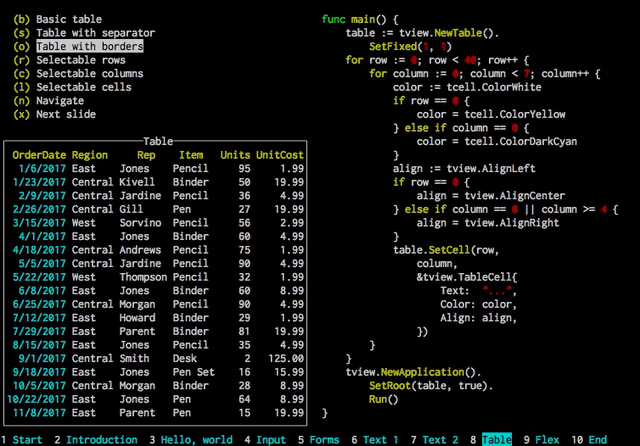

# Rich Interactive Widgets for Terminal UIs

[](https://godoc.org/github.com/rivo/tview)
[](https://goreportcard.com/report/github.com/rivo/tview)

This Go package provides commonly needed components for terminal based user interfaces.



Among these components are:

- __Input forms__ (include __input/password fields__, __drop-down selections__, __checkboxes__, and __buttons__)
- Navigable multi-color __text views__
- Sophisticated navigable __table views__
- Flexible __tree views__
- Selectable __lists__
- __Grid__, __Flexbox__ and __page layouts__
- Modal __message windows__
- An __application__ wrapper

They come with lots of customization options and can be easily extended to fit your needs.

## Installation

```bash
go get github.com/rivo/tview
```

## Hello World

This basic example creates a box titled "Hello, World!" and displays it in your terminal:

```go
package main

import (
	"github.com/rivo/tview"
)

func main() {
	box := tview.NewBox().SetBorder(true).SetTitle("Hello, world!")
	if err := tview.NewApplication().SetRoot(box, true).Run(); err != nil {
		panic(err)
	}
}
```

Check out the [GitHub Wiki](https://github.com/rivo/tview/wiki) for more examples along with screenshots. Or try the examples in the "demos" subdirectory.

For a presentation highlighting this package, compile and run the program found in the "demos/presentation" subdirectory.

## Documentation

Refer to https://godoc.org/github.com/rivo/tview for the package's documentation.

## Dependencies

This package is based on [github.com/gdamore/tcell](https://github.com/gdamore/tcell) (and its dependencies).

## Your Feedback

Add your issue here on GitHub. Feel free to get in touch if you have any questions.

## Version History

(There are no corresponding tags in the project. I only keep such a history in this README.)

- v0.19 (2018-10-28)
  - Added `QueueUpdate()` and `QueueEvent()` to `Application` to help with modifications to primitives from goroutines.
- v0.18 (2018-10-18)
  - `InputField` elements can now be navigated freely.
- v0.17 (2018-06-20)
  - Added `TreeView`.
- v0.15 (2018-05-02)
  - `Flex` and `Grid` don't clear their background per default, thus allowing for custom modals. See the [Wiki](https://github.com/rivo/tview/wiki/Modal) for an example.
- v0.14 (2018-04-13)
  - Added an `Escape()` function which keep strings like color or region tags from being recognized as such.
  - Added `ANSIWriter()` and `TranslateANSI()` which convert ANSI escape sequences to `tview` color tags.
- v0.13 (2018-04-01)
  - Added background colors and text attributes to color tags.
- v0.12 (2018-03-13)
  - Added "suspended mode" to `Application`.
- v0.11 (2018-03-02)
  - Added a `RemoveItem()` function to `Grid` and `Flex`.
- v0.10 (2018-02-22)
  - Direct access to the `screen` object through callback in `Box` (i.e. for all primitives).
- v0.9 (2018-02-20)
  - Introduced `Grid` layout.
  - Direct access to the `screen` object through callbacks in `Application`.
- v0.8 (2018-01-17)
  - Color tags can now be used almost everywhere.
- v0.7 (2018-01-16)
  - Forms can now also have a horizontal layout.
- v0.6 (2018-01-14)
  - All primitives can now intercept all key events when they have focus.
  - Key events can also be intercepted globally (changed to a more general, consistent handling)
- v0.5 (2018-01-13)
  - `TextView` now has word wrapping and text alignment
- v0.4 (2018-01-12)
  - `TextView` now accepts color tags with any W3C color (including RGB hex values).
  - Support for wide unicode characters.
- v0.3 (2018-01-11)
  - Added masking to `InputField` and password entry to `Form`.
- v0.2 (2018-01-10)
  - Added `Styles` variable with default colors for primitives.
  - Completed some missing InputField functions.
- v0.1 (2018-01-06)
  - First Release.
